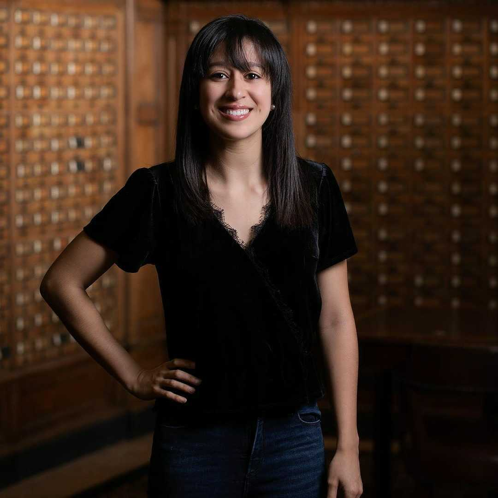

# Our Team

## Primary Investigator 

 *Giovanni Ferrari, PhD*

<left>
{width=25%}

</left>

First-generation graduate (U of Pavia, 2003), I am a group leader and Associate Professor (with tenure) at Columbia University, Dept. of Surgery and Biomedical Engineering. I am Scientific Director of the Cardiothoracic Research Program and Director of the Columbia Biobank for Translational Science, an applied biobank supporting translational and precision medicine initiatives. Heart valve and vascular cell physiology, cardiac mechanobiology, materials science in medical devices, and the brain-heart axis are my main research interests.

</right>

* [Twitter](https://twitter.com/ferrag02)
* [Email](mailto:<gf2375@cumc.columbia.edu>)

\
	
## Lab Members 

### Associate Research Scientists

*Esti Castillero, PhD*
 
[Twitter](https:twitter.com/esticastillero)

*Chiara Camillo, PhD*

\

### Postdoctoral Research Fellows	

 *Yingfei Xue, PhD*\
 
{width=25%}

Dr. Yingfei Xue is currently a postdoctoral research scientist in Dr. Giovanni Ferrari lab at Columbia University. He obtained his PhD degree from [University of Pittsburgh School of Pharmacy](http://www.pharmacy.pitt.edu/research/research_index.php). His research interest is centered around cardiovascular implants including bioprosthetic valves, conduits, and patches. His research goal is to understand the mechanisms of cardiovascular implant failure and improve implant durability. He has 20 publications and served as editorial board member and reviewer for multiple journals in the fields of biomedical engineering.

[Email](mailto:<yx2529@cumc.columbia.edu>)\

 

*Antonio Frasca, PhD*

\

### Surgical Residents			

*Alexey Abramov, MD*

{width=25%}

Dr. Alexey Abramov is a General Surgery resident in the [New York Presbyterian-Columbia](https://columbiasurgery.org/general-surgery-residency) program with an interest in cardiothoracic surgery fellowship. Currently, he is a post-doctoral research fellow in Dr. Ferrari's lab in the [Cardiothoracic Surgery Research Group](https://columbiasurgery.org/cardiothoracic-surgery-research/program-overview) and pursuing a Master's degree in the Department of Biostatistics in the Mailmans School of Public Health with a concentration in [Clinical Research Methods](https://www.publichealth.columbia.edu/academics/degrees/master-science/clinical-research-methods). In his free time, he enjoys the outdoors, hiking, skiing, and riding his road bike.

[Email](mailto:<aa3832@cumc.columbia.edu>)
 
*Dov Levine, MD*

*Clinton Erwin, MD*

{width=25%}

*Michael Simpson, MD*

\

### Biobank			

 *Vivian Moreno*

{width=25%}

Vivian Moreno, is the clinical research coordinator for the Ferrari Lab. She completed her Bachelor’s of Science in Biomedical Science at the University of Kent in Canterbury, England. Her research background includes cancer research at Yale University and novel antimicrobial peptides at NovaBiotics, Ltd. Her favorite pastimes include playing the piano, volunteering, and working out at AARMY.

[Email](mailto:<vmm2142@cumc.columbia.edu>)

\

### Lab Manager

 *Mangesh Kurade*

\

### Medical Students

 *Nicolo Vitale (U of Milan)*
 
 {width=25%}
 
 *Eduardo (U of Bologna)*
 
 *Ervin (Morehouse School of Medicine)*

\

### Biomedical Engineering Students		

*Mar Martinez Mas (Columbia University)*\

{width=25%}

Ms. Mar Martinez Mas is a Master’s student in [Biomedical Engineering at Columbia University](https://www.bme.columbia.edu). She is from Barcelona, Spain, and  completed her undergraduate degree at [Universitat Pompeu Fabra](https://www.upf.edu/es/) where sbe worked in the field of biomedical electronics. Afterward, she completed the last year and a half of my degree at the [Politecnico di Milano](https://www.polimi.it), where she mainly studied the field of biomechanics. Her main interest lies in prosthetic heart valves and life support systems. She joined the Ferrari Lab in 2021. 

[Email](mailto:<mm5944@columbia.edu>)

\

### Chief Vision Officer 

*Churro*

{width=25%}

2 years old Irish-Doodle. Strong interest in any type of food.
Life's not ruff when I am around. Woof

### Alumni

Residents

Postdocs

\

## Collaborators

{width=25%}

### Robert J. Levy, MD
Levy is the director of Cardiology Research, and also serves as program director of the Cardiology National Heart, Lung, and Blood Institute (NHLBI) Research Training Grant. 

His research interests are the pathophysiology of biomaterials used in medicine, basic mechanisms and novel therapies for heart valve disease, arterial angioplasty, local drug delivery, and nanomedicine. He also has experience over three decades in medical device development.

*R01HL131872*

\

### David Kalfa, MD, PhD\

{width=25%}

Florence Irving Assistant Professor of Surgery\
Section of Pediatric & Congenital Cardiac Surgery\
Director, Pediatric Heart Valve Center\
Surgical Director, Initiative for Pediatric Cardiac Innovation\
Columbia University College of Physicians and Surgeons\
New York-Presbyterian Morgan Stanley Children's Hospital\

#### Expandable Polymeric-valved Conduit to Repair Congenital Heart Disease

The proposed research is relevant to public health because a biostable polymeric valved conduit that can be implanted surgically to reconstruct the right ventricular outflow tract in neonates and infants and then expanded by successive transcatheter procedures to reach the adult size, would revolutionize how we treat children with heart valve diseases. Such a new generation of valved conduit would decrease the number of open-heart surgeries and reoperations, decrease the mortality, complications and healthcare costs related to these procedures and increase the life expectancy and quality of life of these patients.

*R01HL155381*

\

### Micheal S Sacks PhD

{width=25%}

The bicuspid aortic valve (BAV) is the most common cardiac congenital anomaly. Due to the widespread availability and routine use of screening echocardiography, development of clinical methods for the identification of asymptomatic young patients with BAV is now realistic. We thus plan to develop sensitive, clinically derivable functional indices that will yield clinically relevant patient- specific strategies for identifying BAV patients at high risk.

*R01HL142504*

#### Walter 
