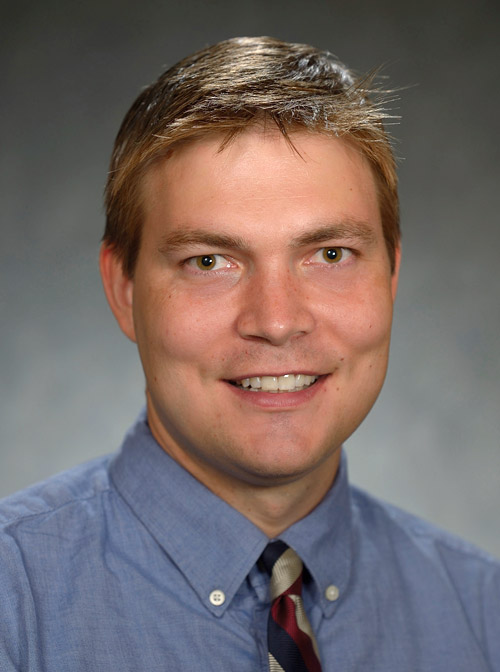

# Primary Investigator 

\

{width=25%}

### Giovanni Ferrari, PhD

First-generation graduate at the [U of Pavia](https://web-en.unipv.it) (2003), I am a group leader and Associate Professor (with tenure) in the Columbia University, [Department of Surgery](https://columbiasurgery.org/research) and [School of Biomedical Engineering](https://www.bme.columbia.edu). \

I am the Scientific Director of the [Cardiothoracic Research Program and Director of the Columbia Biobank for Translational Science](https://columbiasurgery.org/research/ferrari-lab), an applied biobank supporting translational and precision medicine initiatives.\

My main research interests are in heart valve and vascular cell physiology, cardiac mechanobiology, materials science in medical devices, and the brain-heart axis.

* [Twitter](https://twitter.com/ferrag02)
* [Email](mailto:<gf2375@cumc.columbia.edu>)

\
	
#  Ferrari Lab Members 

\

### Associate Research Scientists

\

{width=25%}

#### *Esti Castillero, PhD*

I am a Biomedical Researcher with a PhD in Physiology and Endocrinology. My research focuses on the study of the advanced stages of myocardial and cardiac valve remodeling. My research argues that cardiac remodeling is regulated both at a local and systemic level and that it may, in turn, affect remote tissues by endocrine crosstalk. \

Currently, I am leading projects that explore myocardium-cardiac valve communication in the adaptation to ischemic injury and the role of circulating factors from the skeletal muscle in cardiac remodeling in end-stage heart failure. 

[Email](mailto:<ec2929@cumc.columbia.edu>)\
*(recommendations for mystery books welcome)*

[Google Scholar](https://scholar.google.com/citations?hl=en&user=02qHMNkAAAAJ)\

\

#### *Chiara Camillo, PhD*

\

---

\

### Postdoctoral Research Fellows	

{width=25%}

#### *Yingfei Xue, PhD*\

Dr. Yingfei Xue is currently a postdoctoral research scientist in Dr. Giovanni Ferrari lab at Columbia University. He obtained his PhD degree from [University of Pittsburgh School of Pharmacy](http://www.pharmacy.pitt.edu/research/research_index.php). His research interest is centered around cardiovascular implants including bioprosthetic valves, conduits, and patches. \

His research goal is to better understand the mechanisms of cardiovascular implant failure and improve implant durability. He has 20 publications and served as editorial board member and reviewer for multiple journals in the fields of biomedical engineering.

[Email](mailto:<yx2529@cumc.columbia.edu>)\

\

#### *Antonio Frasca, PhD*

\

---

\

### Surgical Residents

\

{width=25%}

#### *Alexey Abramov, MD*

Dr. Alexey Abramov is a General Surgery resident in the [New York Presbyterian-Columbia](https://columbiasurgery.org/general-surgery-residency) program with an interest in cardiothoracic surgery fellowship and biomedical engineering.  He graduated from [Emory University](http://college.emory.edu/main/index.html) and received his medical degree from [New York Medical College](https://www.nymc.edu/school-of-medicine-som/).\

Currently, he is a post-doctoral research fellow in Dr. Ferrari's lab studying the underlying mechanisms of structural degeneration of bioprosthetic heart valves with next-generation proteomics. He is also pursuing a Master's degree in the [Department of Biostatistics in the Mailmans School of Public Health](https://www.publichealth.columbia.edu/academics/degrees/master-science/clinical-research-methods) track. \
In his free time, he enjoys the outdoors, hiking, skiing, and riding his road bike.

[Email](mailto:<aa3832@cumc.columbia.edu>)

\
 
#### *Dov Levine, MD*

\

{width=25%}

#### *Clinton Erwin, MD*

Clinton is a resident in  [Integrated Cardiothoracic surgery at New York Presbyterian-Columbia](https://columbiasurgery.org/cardiothoracic-training). He obtained his MD from [University of Alabama at Birmingham](https://www.uabmedicine.org), where he developed an interest in cardiac surgery. \

Now having completed 3 years of residency, he is currently studying the mechanisms of cardiovascular damage related to COVID-19, along with several clinical projects in adult cardiac surgery.   

[Email](mailto:<we2153@cumc.columbia.edu>)

\

#### *Michael Simpson, MD*

Michael is a resident in the Integrated Cardiothoracic Surgery residency program at New York Presbyterian-Columbia. He obtained his MD from Columbia University College of Physicians & Surgeons. He has completed three years of his cardiac surgical training and has an interest in aortic surgery and structural heart disease. He is currently studying pathologic mechanisms in mitral valve disease and is involved in several clinical projects across the spectrum of adult cardiac surgery. 

[Email](mailto:<mts2153@cumc.columbia.edu>)

\

{width=25%}
 
#### *Nicolò Vitale, MD*\
*U of Milan*

Nicolò Vitale is cardiac surgery resident at [Università degli studi di Milano](https://www.unimi.it/it). He obtained his MD from Università degli studi di Milano. He is very interested in the mechanisms of ischemic heart failure. He is currently studying the mechanisms of structural degeneration of the pediatric bioprosthetic conduits.

\

---

### Biobank			

{width=25%}

#### *Vivian Moreno*

Vivian Moreno is the Clinical Research Coordinator for the Ferrari Lab. She completed her Bachelor’s of Science in Biomedical Science at the [University of Kent in Canterbury, England](https://www.kent.ac.uk). Her research background includes cancer research at Yale University and novel antimicrobial peptides at [NovaBiotics, Ltd](https://novabiotics.co.uk). Her favorite pastimes include playing the piano, volunteering, and working out at AARMY.

[Email](mailto:<vmm2142@cumc.columbia.edu>)

\

---

#### Lab Manager

#### *Mangesh Kurade*

\

---

### Medical Students
 
#### *Edoardo Bianco* \
*U of Bologna*

\

{width=25%}

#### *Evan Woodard* \
*Morehouse School of Medicine*

I am Evan Woodard and I am a current 2nd year medical student at Morehouse School of Medicine interested in a career in cardiothoracic surgery. Some of my research and clinical interest include patient outcomes research and minimally invasive surgical techniques. 

\

---

### Biomedical Engineering Students		

{width=25%}

#### *Mar Martinez Mas*
*Columbia University*\

Mar Martinez Mas is a Master’s student in [Biomedical Engineering at Columbia University](https://www.bme.columbia.edu). She is from Barcelona, Spain, and completed her undergraduate degree at [Universitat Pompeu Fabra](https://www.upf.edu/es/) (Barcelona, Spain) where she worked in the field of biomedical electronics. Afterward, she completed the last year and a half of her degree at the [Politecnico di Milano](https://www.polimi.it) (Milan, Italy), where she mainly studied the field of biomechanics.\
Her main interest lies in prosthetic heart valves and life support systems. She joined the Ferrari Lab in 2021 and is studying the mass and tissue thickening of cardiac valvular bioprostheses under different conditions.

[Email](mailto:<mm5944@columbia.edu>)

\

---

### Chief Vision Officer 

{width=25%}

#### *Churro*

2 years old Irish-Doodle. Strong interest in any type of food.
Life's not ruff when I am around. Woof

\

---

### Alumni

Residents

Postdocs

\

---

#  Collaborators 

{width=25%}

### Robert J. Levy, MD\

*Children's Hospital of Philadelphia*\

Levy is the director of Cardiology Research, and also serves as program director of the Cardiology [National Heart, Lung, and Blood Institute (NHLBI)](http://www.nhlbi.nih.gov) Research Training Grant. 

His research interests are the pathophysiology of biomaterials used in medicine, basic mechanisms and novel therapies for heart valve disease, arterial angioplasty, local drug delivery, and nanomedicine. He also has experience over three decades in medical device development.

\

*R01HL131872*

\

### David Kalfa, MD, PhD\

{width=25%}

Florence Irving Assistant Professor of Surgery\
Section of Pediatric & Congenital Cardiac Surgery\
Director, Pediatric Heart Valve Center\
Surgical Director, Initiative for Pediatric Cardiac Innovation\
Columbia University College of Physicians and Surgeons\

\

 Expandable Polymeric-valved Conduit to Repair Congenital Heart Disease 

The proposed research is relevant to public health because a biostable polymeric valved conduit that can be implanted surgically to reconstruct the right ventricular outflow tract in neonates and infants and then expanded by successive transcatheter procedures to reach the adult size, would revolutionize how we treat children with heart valve diseases. Such a new generation of valved conduit would decrease the number of open-heart surgeries and reoperations, decrease the mortality, complications and healthcare costs related to these procedures and increase the life expectancy and quality of life of these patients.

\

*R01HL155381*

\

### Micheal S Sacks PhD\

*University of Texas at Austin*

{width=25%}

The bicuspid aortic valve (BAV) is the most common cardiac congenital anomaly. Due to the widespread availability and routine use of screening echocardiography, development of clinical methods for the identification of asymptomatic young patients with BAV is now realistic. We thus plan to develop sensitive, clinically derivable functional indices that will yield clinically relevant patient- specific strategies for identifying BAV patients at high risk.\

\

*R01HL142504*

[Lab Website](https://wccms.oden.utexas.edu)

\

### Lara Garibeh PhD\

*University of Ottawa Heart Institute*

*Canadian Institute of Research and Health (CIHR) Fellowship (2021-2023)*\

{width=25%}

Identification of Molecular Pathways that Protect Against Atherosclerosis
Coronary artery disease (CAD) is one of the leading causes of cardiovascular death worldwide. Current treatments for CAD include lifestyle modifications and medical therapies to reduce its risk factors. When these methods fail, more invasive interventions, such as placement of a stent to restore blood flow or performance of a coronary artery bypass graft surgery, are used. This latter procedure aims at bypassing the blocked area using either veins or arteries. The use of arterial grafts is associated with a better long-term patency and a reduced rate of progression of atherosclerosis when compared to vein grafts. Yet, the exact molecular mechanisms by which arteries are protected from disease progression are not well understood. This study aims to identify the underlying mechanisms that render arteries resistant to atherosclerosis.\

[LinkedIn](https://www.linkedin.com/in/lara-gharibeh/)

\

### Juan B Grau MD\

*The Valley Hospital *

{width=25%}

Dr. Grau's work blends clinical knowledge and expertise with the tools of basic science to find new approaches to clinically relevant problems. He serves as a reviewer for the Annals of Thoracic Surgery, Journal of the American Heart Association, Circulation, and the British Heart Foundation, among others.\

\

### Walter R. Witschey, PhD\

*University of Pennsylvania*
Associate Professor of Radiology\
Director of the Advanced Cardiovascular Imaging Lab at the University of Pennsylvania\

{width=25%}

Theoretical and applied advanced imaging, especially magnetic resonance imaging and quantitative cardiovascular imaging.

[Lab Website](https://www.med.upenn.edu/corlab/)

\

