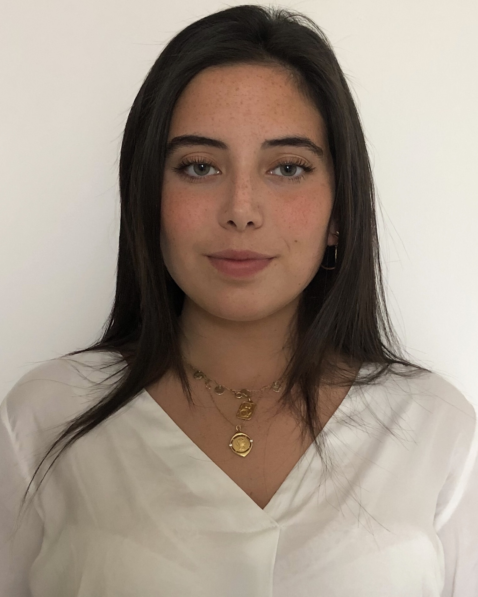

# Our Team

## Primary Investigator 

 *Giovanni Ferrari, PhD*

<left>
{width=25%}

</left>

First-generation graduate (U of Pavia, 2003), I am a group leader and Associate Professor (with tenure) at Columbia University, Dept. of Surgery and Biomedical Engineering. I am Scientific Director of the Cardiothoracic Research Program and Director of the Columbia Biobank for Translational Science, an applied biobank supporting translational and precision medicine initiatives. Heart valve and vascular cell physiology, cardiac mechanobiology, materials science in medical devices, and the brain-heart axis are my main research interests.

</right>

* [Twitter](https://twitter.com/ferrag02)
* [Email](mailto:<gf2375@cumc.columbia.edu>)

\
				
### Associate Research Scientists

*Esti Castillero, PhD*
 
[Twitter](https:twitter.com/esticastillero)

*Chiara Camillo, PhD*

\

### Postdoctoral Research Fellows	

 *Yingfei Xue, PhD*\
 
{width=25%}

Dr. Yingfei Xue is currently a postdoctoral research scientist in Dr. Giovanni Ferrari lab at Columbia University. He obtained his PhD degree from [University of Pittsburgh School of Pharmacy](http://www.pharmacy.pitt.edu/research/research_index.php). His research interest is centered around cardiovascular implants including bioprosthetic valves, conduits, and patches. His research goal is to understand the mechanisms of cardiovascular implant failure and improve implant durability. He has 20 publications and served as editorial board member and reviewer for multiple journals in the fields of biomedical engineering.

[Email](mailto:<yx2529@cumc.columbia.edu>)\

 

*Antonio Frasca, PhD*

\

### Surgical Residents			

*Alexey Abramov, MD*

{width=25%}

Dr. Alexey Abramov is a General Surgery resident in the [New York Presbyterian-Columbia](https://columbiasurgery.org/general-surgery-residency) program with an interest in cardiothoracic surgery fellowship. Currently, he is a post-doctoral research fellow in Dr. Ferrari's lab in the [Cardiothoracic Surgery Research Group](https://columbiasurgery.org/cardiothoracic-surgery-research/program-overview) and pursuing a Master's degree in the Department of Biostatistics in the Mailmans School of Public Health with a concentration in [Clinical Research Methods](https://www.publichealth.columbia.edu/academics/degrees/master-science/clinical-research-methods). In my free time, he enjoys the outdoors, hiking, skiing, and riding his road bike.

[Email](mailto:<aa3832@cumc.columbia.edu>)
 
*Dov Levine, MD*

*Clinton Erwin, MD*

*Michael Simpson, MD*

\

### Biobank			

 *Vivian Moreno*

{width=25%}

\

### Lab Manager

 *Mangesh Kurade*

\

### Medical Students

 *Nicolo Vitale (U of Milan)*
 
 {width=25%}
 
 *Eduardo (U of Bologna)*
 
 *Ervin (Morehouse School of Medicine)*

\

### Biomedical Engineering Students		

*Mar Martinez Mas (Columbia University)*\

{width=25%}

Ms. Mar Martinez Mas is a Master’s student in [Biomedical Engineering at Columbia University](https://www.bme.columbia.edu). She is from Barcelona, Spain, and  completed her undergraduate degree at [Universitat Pompeu Fabra](https://www.upf.edu/es/) where sbe worked in the field of biomedical electronics. Afterward, she completed the last year and a half of my degree at the [Politecnico di Milano](https://www.polimi.it), where she mainly studied the field of biomechanics. Her main interest lies in prosthetic heart valves and life support systems. She joined the Ferrari Lab in 2021. 

[Email](mailto:<mm5944@columbia.edu>)

\

### Chief Vision Officer 

*Churro*

2 years old Irish-Doodle. Strong interest in any type of food.
Life's not ruff when I am around. Woof

### Alumni

Residents

Postdocs